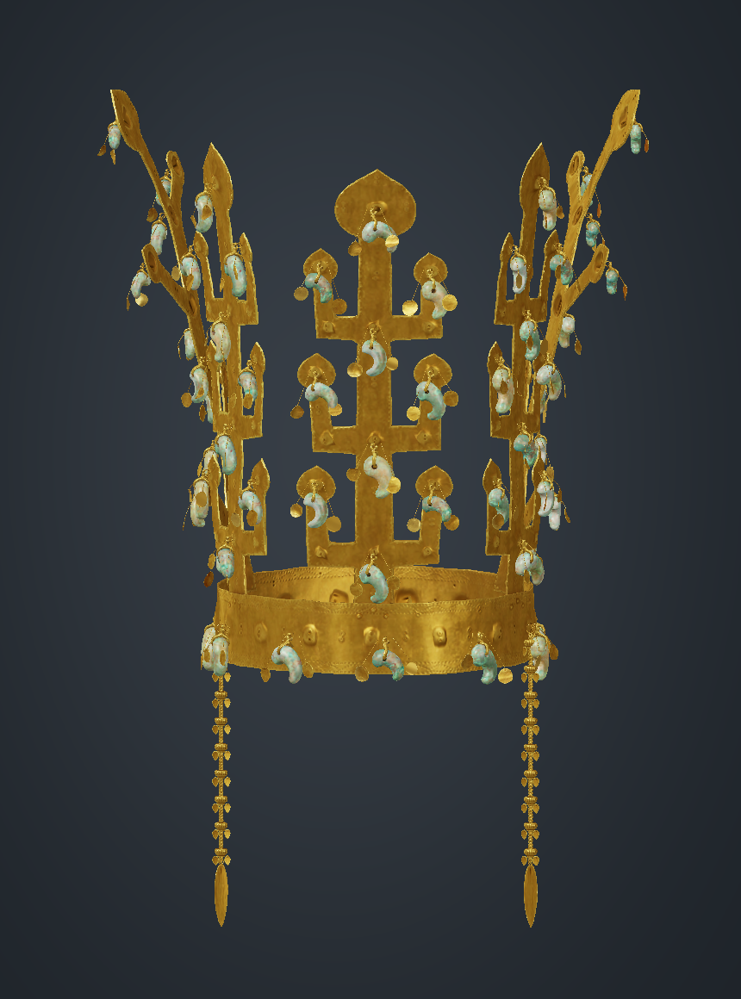
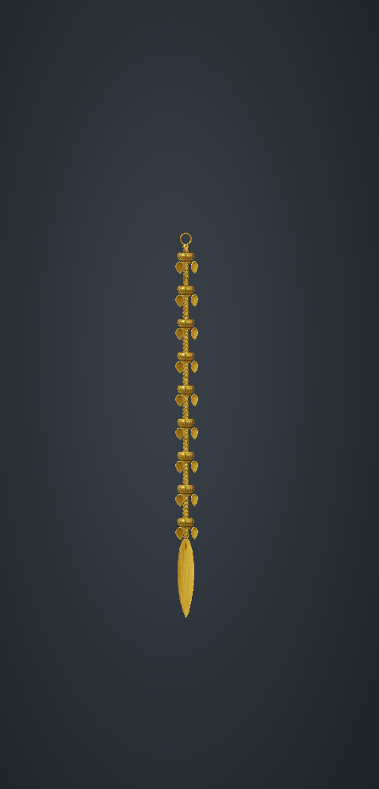

# 금관 양옆 수식 보완 · 2026-09-06

기존 금관총 자료 기반 v3 모델에 천마총 금관의 양옆 늘어뜨린 장식을 참고해 수식 두 개를 추가했습니다.

- [현재 금관 페이지](https://qkfmsclzls22-sudo.github.io/silla-ar/crown/)
- [수정 GLB](../crown_side_ornaments_v4.glb)
- [파일 검증 결과](../crown_side_ornaments_v4.validation.json)

## 추가한 부분

- 관테 좌우에 장착 고리, 연속 사슬, 금색 마디와 작은 달개, 끝의 긴 잎 모양 장식을 연결했습니다.
- 좌우 장식은 `Left_side_pendant`, `Right_side_pendant` 그룹으로 분리해 길이·위치·방향을 따로 수정할 수 있습니다.
- 사슬·마디·작은 달개는 사용자가 제공한 원본 금관의 부품과 UV를 사용했습니다. 끝 장식은 원본 잎 부품의 비율을 길고 가늘게 조정했습니다.
- 기존 v3 본체의 메시·곡옥·달개·텍스처와 재질은 보존했습니다. 바닥 정렬을 위한 전체 모델 위치만 조정했습니다.
- 모델 내 수식 길이는 약 19.2cm이며, 좌우 각각 금색 마디 9개와 작은 달개 18개를 배치했습니다. 이 수치와 연결 방식은 시각화를 위한 추정이며 실물의 측정·개수 확인 결과는 아닙니다.

## 실제 GLB 검토 이미지





저장한 GLB의 실제 메시와 텍스처를 다시 읽어 CPU로 렌더했습니다.

## 참고 자료와 확인 범위

- 형태 참고: [Gold Crown From Cheonmachong Tomb](https://sketchfab.com/3d-models/gold-crown-from-cheonmachong-tomb-d9b3c2ddf8464605a8dd9e9b0f2b5f3e), KOREA HERITAGE SERVICE [KHS] / 국가유산청. 해당 페이지에 표시된 라이선스: [CC BY 4.0](https://creativecommons.org/licenses/by/4.0/).
- 참고 페이지와 표시 이미지를 확인했으며, 해당 사이트의 3D 메시를 다운로드해 합친 것은 아닙니다.
- 이 모델은 금관총 기반 본체에 천마총 수식의 형태를 참고한 구성입니다. 천마총 금관 전체를 정확히 복원한 모델로 설명하지 않습니다.
- GLB 길이, 유한 좌표·법선, 법선 길이, 인덱스 범위, 기존 바이너리 11,549,908 bytes 및 재질 보존을 확인했습니다.
- 최종 GLB: 12,207,628 bytes. SHA-256: `f2403497e154c87df5426389e640312e8661141eaf0a807f7d1204f71f23e5e1`.
- 장면 삼각형 444,666개. 기존 본체에 수식용 고유 메시 6개를 추가했습니다.
- iPhone에서 이전 금관 USDZ가 열리지 않도록 페이지의 `ios-src`를 제거하고 현재 GLB에서 Quick Look용 USDZ를 자동 생성하도록 연결했습니다. 휴대폰 AR 실기기 검수는 미완료입니다.

## 다시 수정하기

`build_side_ornaments_v4.py`와 `source_ornament_parts.npz`로 재현할 수 있습니다. 기준 v3 GLB는 기존 `crown_refined_v3_package.zip`에 들어 있습니다.

```sh
python build_side_ornaments_v4.py --base crown_source_refined_v3.glb --output crown_side_ornaments_v4.glb
```

선덕여왕 모델은 이번 금관 페이지 변경에 포함하지 않았습니다. 선덕여왕 마무리 작업은 2026-09-07 오전에 이어서 진행하도록 설정했습니다.
