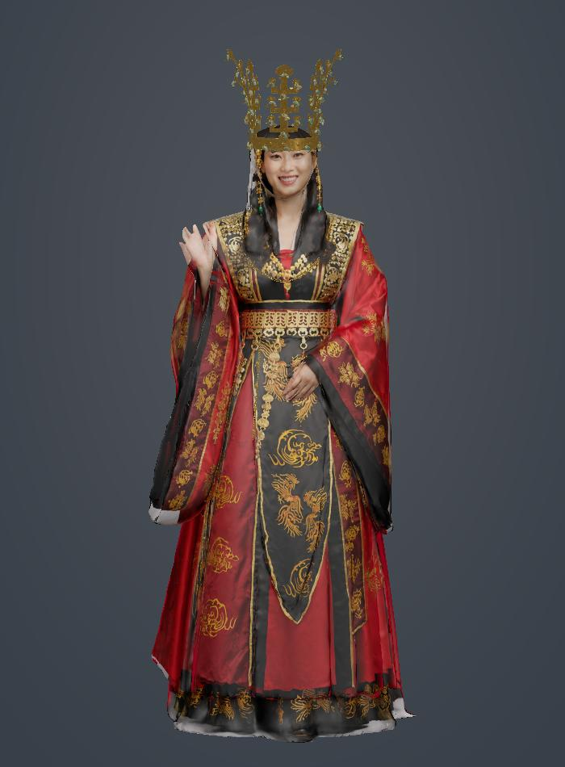
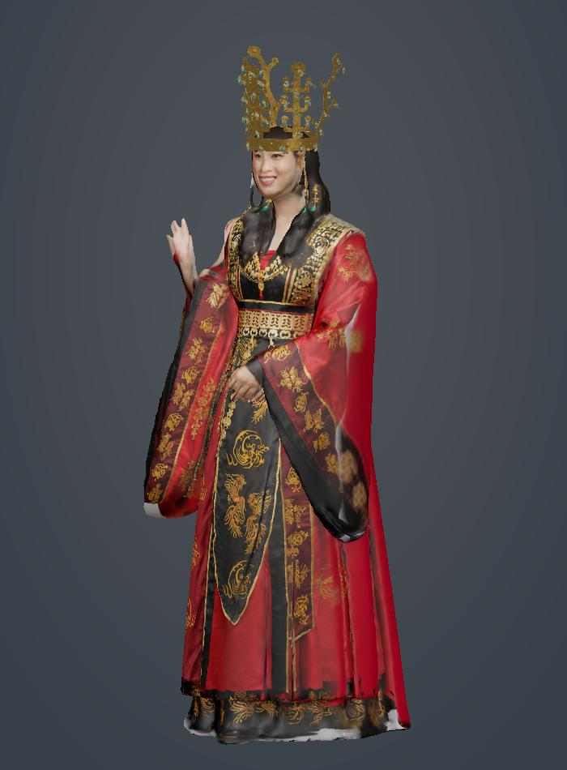
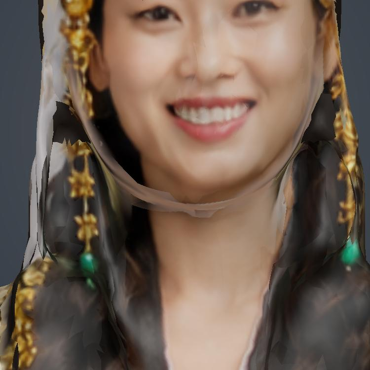
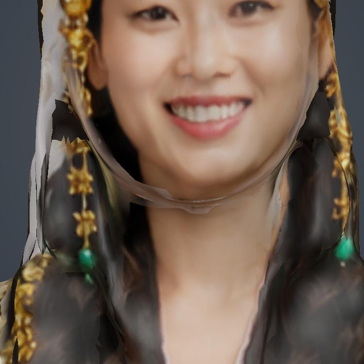
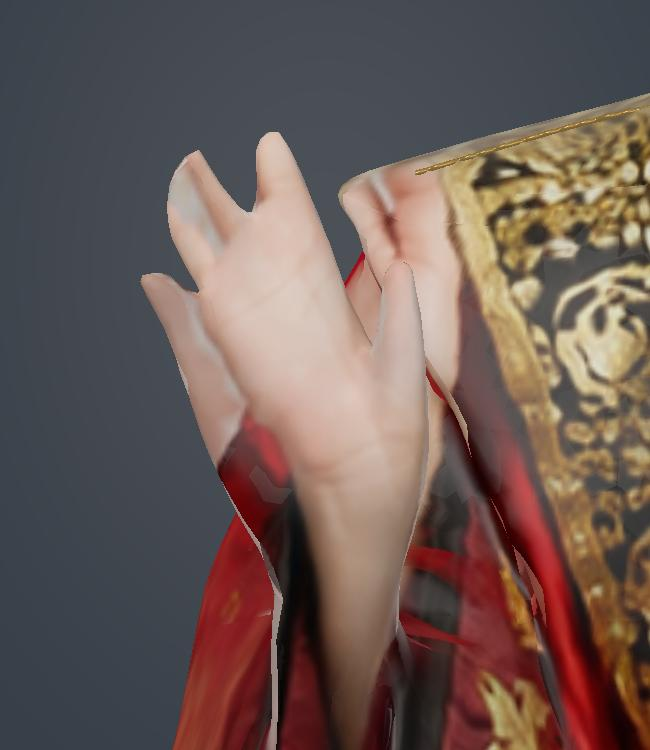
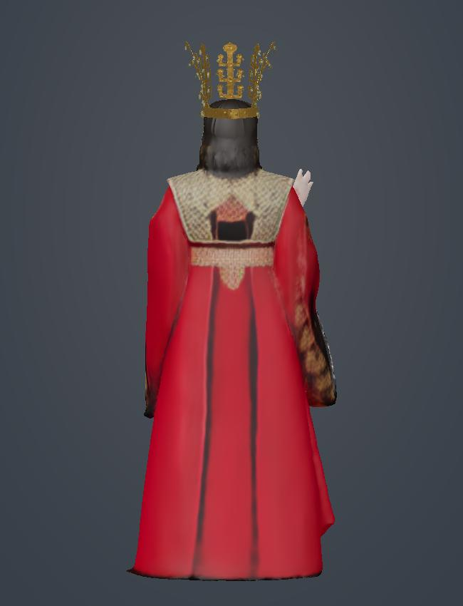
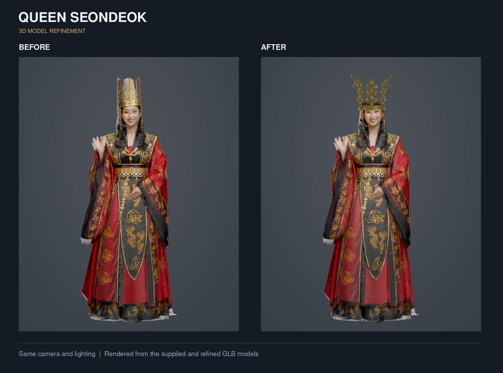
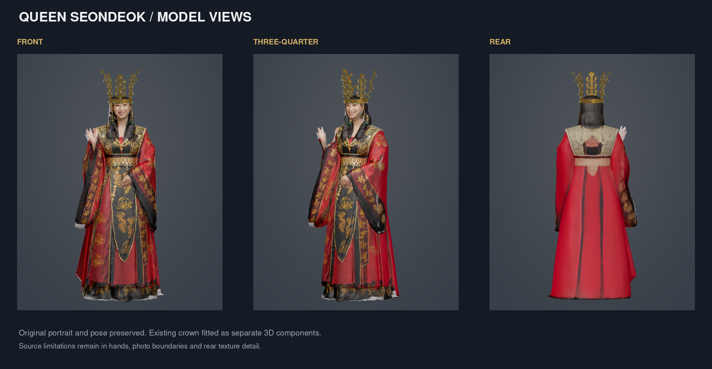

# 선덕여왕 v6 · 얼굴 재구성 및 참고 자료 기반 보완 · 2026-09-07

- **[3D·AR 확인](https://qkfmsclzls22-sudo.github.io/silla-ar/seondeok/)** · **[실제 수정 전후 비교](https://qkfmsclzls22-sudo.github.io/silla-ar/seondeok/review/compare.html)**
- 모델: [`queen_seondeok_refined_v6.glb`](../queen_seondeok_refined_v6.glb)
- 게시 크기: 11,516,632 bytes · SHA-256: `ebc9ea8bf8b5194e18cac03e21b072437e2fc1fa0c0632a1fc41a0e668a01235`
- 사용자 우선순위: 복식 고증보다 선덕여왕 분위기와 자연스러운 완성도, 특히 어색한 얼굴 개선.

## 변경 내용

- 기존 사진 기반 얼굴과 턱의 겹친 경계를 제거하고 눈·코·입·턱을 갖춘 닫힌 입체 머리를 구성했습니다. 부드러운 미소의 새 피부 질감을 얼굴 위치에 맞춰 적용했습니다.
- 피부·목·귓바퀴, 옆머리와 뒷머리를 새로 구성했습니다. 금관 아래 안감을 추가하고 귀 장식을 독립된 형상으로 만들었습니다.
- 들고 있는 손은 손바닥·손목과 분리된 다섯 손가락이 매끈하게 연결되는 닫힌 표면으로 교체했습니다. 배 위에 놓인 손은 원본을 유지했습니다.
- 붉은 예복의 정면은 유지하면서 뒷면에 검정·금색 어깨 자수, 허리띠, 금색 문양과 옷단을 적용했습니다.
- 기존 금관의 형상과 배치는 유지했습니다. 같은 GLB에서 iPhone용 AR 데이터를 생성하도록 이전 USDZ를 별도로 연결하지 않았습니다.
- 확인 페이지에 정면·얼굴 확대·얼굴 옆면·뒷면 버튼, 실제 모델 정지 이미지와 전후 비교 페이지를 추가했습니다.

## 참고 자료와 사용 구분

| 자료 | 사용한 부분 |
|---|---|
| [선덕여왕 즉위식 의상 사진](https://news.nate.com/view/20091117n20900) | 금관·붉은 예복·검정 금색 어깨 장식의 조합과 얼굴·머리 연결 분위기 |
| [씨네21 선덕여왕 의상 사진](https://cine21.com/news/view/?mag_id=56033) | 정면 예복과 금색 문양의 배치·분량 |
| [지온 삼국시대 왕비 03의 후면 사진](https://jiondress.com/88/?idx=154) | 뒷면의 비단 주름, 금색 문양 반복과 옷단 표현 |
| [MBC 옛드 선덕여왕 51회 재생목록](https://www.youtube.com/playlist?list=PLOBbhydezQbfEQYf99LFyGe-RpX-xB7Ny) | 관련 영상 위치를 확인한 참고 링크. 영상 프레임을 추출해 적용하지는 않음 |
| [MediaPipe canonical face mesh](https://github.com/google-ai-edge/mediapipe/blob/master/mediapipe/modules/face_geometry/data/canonical_face_model.obj) | 얼굴의 기본 연결 구조. Apache 2.0 라이선스 동봉, 생성 얼굴에 맞춰 수정 |

외부 사진은 시각적 참고로 사용했으며 사진 파일을 저장소에 재배포하거나 모델에 그대로 붙이지 않았습니다. 얼굴·후면·머리카락 질감은 내장 Imagegen으로 생성한 창작 자료입니다. 고증 복원이나 실제 인물의 모습을 확정한 결과가 아닙니다.

## 검증·한계

- 최종 파일의 형식·형상 검증 수치는 `queen_v6_validation.json`과 `queen_v6_khronos.json`에 기록합니다.
- 전송 한도와 모바일 로딩을 위해 Draco 16비트 형상 압축을 적용하고 원본의 불투명 색상 지도 2개를 해상도 변경 없이 JPEG 품질 90으로 재인코딩했습니다. 나머지 내장 이미지 7개는 원시 바이트를 유지했습니다. 원본 제작 파일에서 금관 형상을 그대로 유지했고, 게시용 압축의 실제 정점 오차·면적이 0인 삼각형 제거 수를 별도로 검증했습니다. 세부 설정은 `queen_v6_compression.json`에 기록합니다.
- 비교 이미지는 실제 게시 GLB를 Draco 해제한 후 CPU로 렌더한 결과입니다. `rebuild/v6_assets/*projection*.png`는 보완용 생성 질감이며 검수용 3D 렌더와 구분합니다.
- Khronos 검사에서 오류·경고는 0개입니다. 검사기가 Draco 확장 자체를 검사하지 못하므로, 별도 디코딩·형상 비교를 함께 실행했습니다.
- 현재 확인용 브라우저는 WebGL 컨텍스트가 비활성화되어 회전·AR 동작을 실제로 검수하지 못했습니다. 페이지 연결·게시 파일의 검증과 휴대폰 AR 검증은 다릅니다.
- 어깨·의복 옆선의 일부 원본 질감 경계, 배 위에 놓인 손, 피부와 의복의 해상도 차이는 남아 있습니다. 리깅·애니메이션은 없습니다.

## 재현

`rebuild/build_v6.py`와 `rebuild/v6_assets/`를 사용합니다. 입력은 해시가 지정된 v5입니다. Python에 NumPy, SciPy, Pillow, scikit-image, trimesh가 필요합니다. MediaPipe 추론 결과를 포함해 두었으므로 다시 빌드할 때 추론 모델을 다운로드할 필요는 없습니다. 소프트웨어 렌더러는 기존 `gltf_tools.py`와 `raster.cpp`를 사용합니다. [생성 방식과 프롬프트](rebuild/v6_assets/generation_notes.md)도 기록했습니다.

게시용 압축은 `rebuild/compress_v6.cjs`를 사용합니다. 파일 상단에 Node 의존성 설치 및 실행 명령이 있습니다. 빌드한 원본을 별도 경로에 보관하고 입력·출력 경로를 다르게 지정합니다. 이 과정에서 검사에 사용할 `.decoded.glb`도 생성됩니다. `verify_v6.py --authored 원본.glb --delivered 게시본.glb --decoded 게시본.decoded.glb`로 원본 보존과 압축 후 오차를 함께 확인합니다. 원본과 디코딩 중간 파일은 게시 페이지에서 사용하지 않습니다.

---

# 선덕여왕 v5 보완본 · 2026-09-07

**현재 상태: 표면·재질 2차 보완본이며, 손가락 재조형과 측후면 고해상도 복원까지 끝난 최종본은 아닙니다.**

- [선덕여왕 확인 페이지](https://qkfmsclzls22-sudo.github.io/silla-ar/seondeok/)
- 현재 모델: [`queen_seondeok_refined_v5.glb`](../queen_seondeok_refined_v5.glb)
- 크기: 22,343,816 bytes / SHA-256: `0b9b8086b0ff1d3964b6b8a149b9c86d9320e18dc603217c990de38d1cd28c6b`
- 시작 전 최신 main `30d5a58`과 작업 지침을 확인했습니다. 이후 선덕여왕 수정이 없어 v4에서 이어 작업했습니다.
- 무관한 `crown/` 페이지와 금관 모델은 수정하지 않았습니다.

## 이번에 반영한 보완

- 손·턱·후면의 국소 표면을 완화했습니다. 최대 정점 이동은 약 2mm이며 손을 들고 있는 자세와 전체 실루엣은 유지했습니다.
- 턱 아래와 손 가장자리의 회색 사진 경계를 주변 피부색에 맞춘 정점 색으로 일부 완화했습니다. 경계를 완전히 제거한 것은 아닙니다.
- 피부·머리카락·복식의 노멀맵 강도를 낮춰 과장된 굴곡과 반짝이는 표면 잡음을 줄였습니다. 후면 이미지의 실제 해상도를 높인 작업은 아닙니다.
- 기존 얼굴 사진, 표정, 붉은 복식과 문양, 금관·장신구를 유지했습니다. 내장 이미지 6개의 원시 바이트, 모든 UV와 삼각형 인덱스, 노드 배치가 동일함을 검사했습니다.
- 페이지는 v5를 불러오며, 이전 USDZ를 별도로 연결하지 않습니다.

## 실제 GLB 검토 이미지

아래는 실제 v4/v5 모델을 동일 조건으로 CPU 렌더한 결과입니다. 생성형 이미지나 휴대폰 AR 화면이 아닙니다. 근접 이미지에서 남은 손가락 결합과 턱 경계를 확인할 수 있습니다.

### 전체 모습





### 턱 경계: 수정 전 → 수정 후





### 손: 수정 전 → 수정 후




### 후면: 수정 전 → 수정 후




## 검증과 남은 작업

- [수치 검증 보고서](queen_v5_validation.json): 유효한 인덱스·유한한 정점값·정규화된 법선·접선 직교성·색상 범위 검사 통과. 장면 삼각형 536,056개, 국소 삼각형 뒤집힘 0개, 용접 후 머리 연결부 열린 경계 0개입니다.
- 눈·입·이마를 포함한 보호 영역의 정점 위치, 금관·장신구 형상은 변경하지 않았습니다.
- 손가락은 원본의 붙거나 빠진 형태가 남아 있습니다. 온전한 손가락 재조형에는 현재 손동작의 정면·측면 참고자료 또는 깨끗한 손 메시를 기준으로 별도 모델링·UV 작업이 필요합니다.
- 턱 아래 띠 모양 경계와 일부 측면 사진 잔여물이 남아 있습니다. 완전한 제거에는 해당 부위 메시와 UV를 함께 재작업해야 합니다.
- 측후면의 흐린 문양은 원본 이미지의 한계입니다. 같은 복식의 고해상도 측후면 이미지 또는 원본 텍스처가 있어야 실제 디테일을 복원할 수 있습니다.
- 웹의 실제 3D 화면 검수와 휴대폰 AR 실기기 검수는 미완료입니다. 이전 확인 환경은 WebGL을 사용할 수 없었으며, 이번 결과를 실제 기기 검수 완료로 표기하지 않습니다.
- 리깅·애니메이션은 없습니다. 역사적 인물의 실제 외모나 출토품 소유를 확정하는 복원이 아닌 창작용 구성입니다.

## 재현 코드

`rebuild/finish_v5.py`는 이 저장소의 v4 해시를 확인한 뒤 동일한 보완을 적용합니다. 다른 버전에는 적용되지 않도록 입력 검사를 둡니다.

```sh
python seondeok/review/rebuild/finish_v5.py
g++ -O3 -shared -fPIC seondeok/review/rebuild/raster.cpp -o seondeok/review/rebuild/raster.so
python seondeok/review/rebuild/verify_v5.py --render
```

Python, NumPy, SciPy, Pillow가 필요합니다. C++ 컴파일은 검토 이미지를 다시 만들 때만 필요합니다. 검사 코드는 자체 수치 검사이며 Khronos 공식 인증을 의미하지 않습니다.

이번 실행 환경: NumPy 2.3.5, SciPy 1.17.0, Pillow 12.3.0. 다시 빌드할 때 수치 라이브러리가 달라지면 부동소수점 결과와 파일 해시는 달라질 수 있습니다.

---

# 이전 작업 기록 · 2026-09-06 · v4

선덕여왕 페이지가 인물·복식을 보완하고 신라 금관을 부착한 수정 모델을 불러오도록 변경했습니다.

- 웹 게시 모델: [`queen_seondeok_refined_v4.glb`](../queen_seondeok_refined_v4.glb)
- 원본 결과물 이름: `선덕여왕.glb` (인물·복식 1차 보완본)
- 크기: 21,708,136 bytes
- SHA-256: `4ca123ce057890e0c7cfd9909a0da894e672709cd97675648c8e0c19d7eed81a`

## 반영된 내용

- 기존 얼굴·표정·자세·붉은 복식과 문양을 유지하면서 얼굴·목·머리카락·의복 표면을 보완했습니다.
- 피부·비단·머리카락·자수 재질을 분리했습니다.
- 이전의 막힌 금관 형상을 제거하고 `crown_source_refined_v3.glb`의 금관·곡옥·장식을 머리에 맞춰 부착했습니다.
- 머리 연결부를 보수하고 목걸이·허리 사슬·어깨 금색 가장자리를 입체 형상으로 추가했습니다.
- 턱 아래 회색 경계를 정점 색상으로 완화했습니다.
- Meshy 복식 모델은 비교 참고만 했으며 합치지 않았습니다.

## 실제 모델의 검토 이미지





이미지는 제공된 원본·수정 GLB를 소프트웨어 렌더한 검토 자료입니다.

## 확인 범위와 남은 부분

- 게시 파일의 바이트·해시를 원래 수정본 및 패키지 검증 보고서와 대조했습니다.
- 검증 보고서는 장면 삼각형 536,056개, 재질 11개, 내장 이미지 6개, 리깅·애니메이션 없음으로 기록합니다.
- 손의 형태, 얼굴·턱 주변의 일부 사진 경계, 흐린 측후면 텍스처는 추가 보완이 필요합니다.
- 금관 착용은 창작용 구성입니다. 실제 선덕여왕의 외모나 특정 출토품의 소유를 확정한 역사 복원은 아닙니다.
- Blender 앱 실행 검증과 휴대폰에서의 최종 AR 실기기 검수는 완료하지 않았습니다.

## iPhone AR 연결

이전 모델의 USDZ가 열리지 않도록 예전 `ios-src` 연결을 제거했습니다. 현재 GLB에서 Quick Look용 USDZ를 생성하는 `model-viewer`의 기본 동작을 사용합니다. [공식 동작 설명](https://modelviewer.dev/examples/augmentedreality/)

이 설정 반영은 iPhone에서 실제로 AR 실행을 검증했다는 뜻은 아닙니다.
